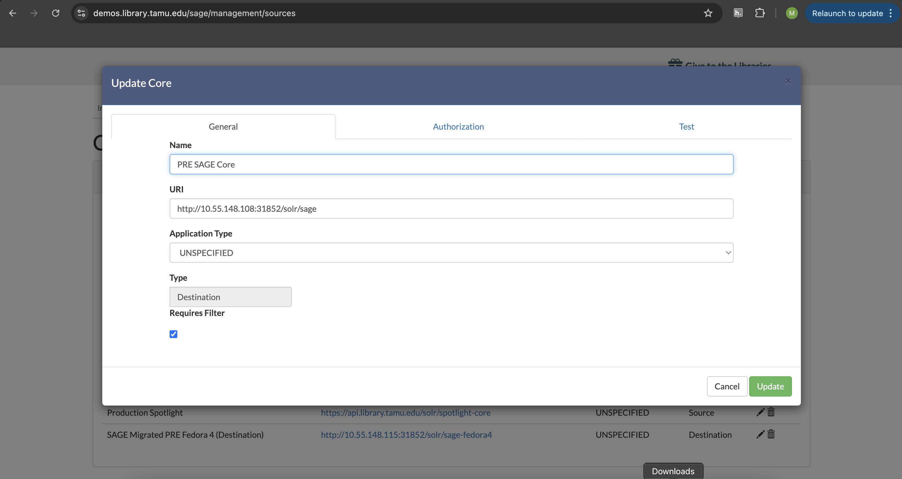

========================================
Creating an Exhibit from Scratch in SAGE
========================================

SAGE is an exhibit and digital collections discovery platform created by developers at Texas A&M University. This
document describes how to create a collection from Scratch in SAGE.

---------------
Core Management
---------------

SAGE relies on Solr for both the source and destination of metadata.  When a new collection is ingested into Fedora, a
command is issued to have Solr reindex Fedora within the appropriate pod (e.g. https://rancher-dev.library.tamu.edu/dashboard/c/c-zfm6r/explorer/apps.deployment/fcrepo4/fedora#pods):

.. code-block:: shell

    curl -X POST http://localhost:9080/reindexing -H "Content-Type: application/json" -d '["broker:queue:solr.reindex"]'

This makes all the metadata and fedora resources be available in Solr. In order to use this source in SAGE, we must add
the Solr Core in Core Management.

The Core Management section lists all known cores and allows you to create a new Core:

.. image:: ../_static/images/cores.png

Doing this requires a URI to the Solr instance followed by the Core, a name, and a type:

-------
Readers
-------

Once you have confirmed your source core is defined, you can create a :code:`Reader`. The reader defines how to read
data from Solr so that it can be written elsewhere. Most new jobs will require new readers.

.. image:: ../_static/images/update_reader.png

A new Reader requires:

* a name that describes the reader
* a source that specifies the source Solr core
* a filter that describes the query against the source core to find matching documents
* and field mappings that describe how to read in data from the source core to a certain concept (e.g. :code:`hasParent` to get the collection that members belong to).

-------
Writers
-------

Writers are the inverse of a reader. Instead of defining how to read data from a source core, the writer defines how to
write data to a destination core. You define it exactly the same as a reader, except the information is about how to write
the new data.

Most new jobs will require a new writer.

----
Jobs
----

For a :code:`Reader` or :code:`Writer` to run and read and write data, a :code:`Job` must be defined and run. Where the
Reader and Writer define what to read and write, the Job defines when and how to do it.

Configuring a job includes:

* a name for the Job
* which readers to run (you can run multiple simultaneously)
* which writers to run (you can run multiple simultaneously)
* any operators to execute and in what order (more on that below)
* whether the job is active (not sure what this means yet)
* and whether to run frequently or on demand

.. image:: ../_static/images/update_job.png

On demand jobs can be run by clicking the play button:

--------
Operator
--------

When creating a new exhibit in SAGE, you'll often find that a job didn't work quite like you'd expected.  When this happens,
you can correct an rerun a job by adding an :code:`Operator`. Operators refine data from a source without touching the
source. There are many types of operators and some documentation about operators is included in the
`wiki <https://github.com/TAMULib/SAGE/wiki/Operators>`_.

Regex_Replace_OP
================

The :code:`Regex_Replace_OP` can be used to run a regular expression versus problematic data from a source Fedora so that
it works correctly in a destination core. For instance, in Basbanes Texts Exhibit, data coming from Fedora to the destination
core resulted in the manifest field including the start of the Fedora url:

.. code-block:: text

https://api-pre.library.tamu.edu/iiif-service/fedora/presentation/https://api-pre.library.tamu.edu/fcrepo/rest/bb/97/f2/3e/bb97f23e-803a-4bd6-8406-06802623554c/basbanes-exhibit-texts-20240924_objects/10

To fix this, we can define an operator to replace the bad string with what the manifest request should look like:

.. image:: ../_static/images/regex_replace.png

In this simple example, we're matching the bad string and replacing it with the good.

Once the operator is defined, we can add it to a job and rerun it with the play button.

------------
Full Example
------------

This walks you through SAGE exhibit creation starting with Solr being updated after a new collection has been ingested
into Fedora.

Step 1: Determine Filter to Works
=================================

Before you start defining a new exhibit and a new reader, first, you should check that you can find the associated works
that you want to be in the exhibit. You can do this with a combination of the Fedora collection URI and the Fedora Solr.
Let's pretend our Fedora collection is :code:`https://api-pre.library.tamu.edu/fcrepo/rest/bb/97/f2/3e/bb97f23e-803a-4bd6-8406-06802623554c/basbanes-exhibit-texts-20240924`
and is in a core called :code:`sage` at http://10.55.148.108:31852/solr. If we go there, we can see if we can find all
members of a collection like so:

