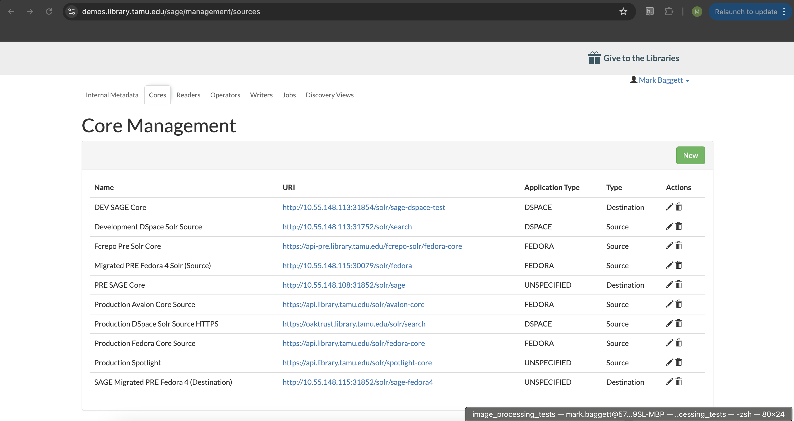
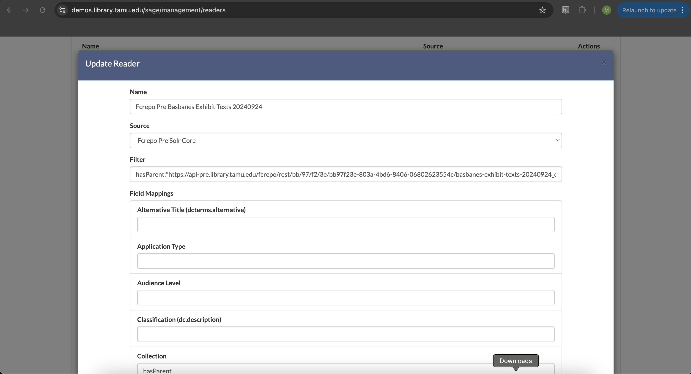
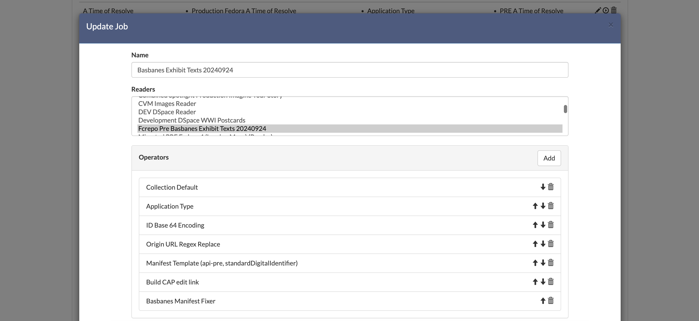
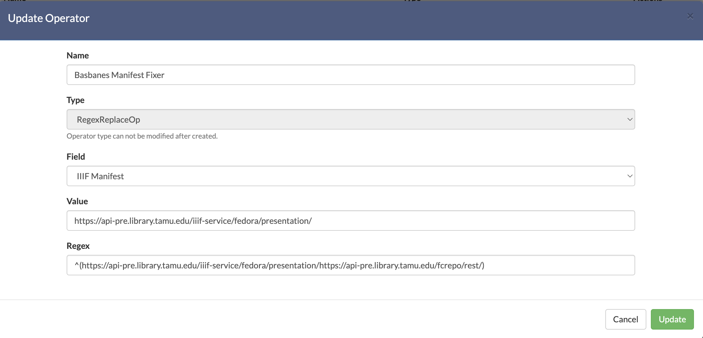

========================================
Creating an Exhibit from Scratch in SAGE
========================================

SAGE is an exhibit and digital collections discovery platform created by developers at Texas A&M University. This
document describes how to create a collection from Scratch in SAGE.

--------------
SAGE Instances
--------------

SAGE can be accessed below:

* `Production <https://library.tamu.edu/discovery/>`_
* `Pre (Maybe Dev too?) <https://demos.library.tamu.edu/sage>`_

---------------
Core Management
---------------

SAGE relies on Solr for both the source and destination of metadata.  When a new collection is ingested into Fedora, a
command is issued to have Solr reindex Fedora within the appropriate pod (e.g. https://rancher-dev.library.tamu.edu/dashboard/c/c-zfm6r/explorer/apps.deployment/fcrepo4/fedora#pods):

.. code-block:: shell

    curl -X POST http://localhost:9080/reindexing -H "Content-Type: application/json" -d '["broker:queue:solr.reindex"]'

This makes all the metadata and fedora resources be available in Solr. In order to use this source in SAGE, we must add
the Solr Core in Core Management.

The Core Management section lists all known cores and allows you to create a new Core:

Doing this requires a URI to the Solr instance followed by the Core, a name, and a type:

.. image:: ../_static/images/core_edit.png

-------
Readers
-------

Once you have confirmed your source core is defined, you can create a :code:`Reader`. The reader defines how to read
data from Solr so that it can be written elsewhere. Most new jobs will require new readers.

A new Reader requires:

* a name that describes the reader
* a source that specifies the source Solr core
* a filter that describes the query against the source core to find matching documents
* and field mappings that describe how to read in data from the source core to a certain concept (e.g. :code:`hasParent` to get the collection that members belong to).

-------
Writers
-------

Writers are the inverse of a reader. Instead of defining how to read data from a source core, the writer defines how to
write data to a destination core. You define it exactly the same as a reader, except the information is about how to write
the new data.

Most new jobs will require a new writer.

----
Jobs
----

For a :code:`Reader` or :code:`Writer` to run and read and write data, a :code:`Job` must be defined and run. Where the
Reader and Writer define what to read and write, the Job defines when and how to do it.

Configuring a job includes:

* a name for the Job
* which readers to run (you can run multiple simultaneously)
* which writers to run (you can run multiple simultaneously)
* any operators to execute and in what order (more on that below)
* whether the job is active (not sure what this means yet)
* and whether to run frequently or on demand

On demand jobs can be run by clicking the play button:

.. image:: ../_static/images/play_button.png

--------
Operator
--------

When creating a new exhibit in SAGE, you'll often find that a job didn't work quite like you'd expected.  When this happens,
you can correct an rerun a job by adding an :code:`Operator`. Operators refine data from a source without touching the
source. There are many types of operators and some documentation about operators is included in the
`wiki <https://github.com/TAMULib/SAGE/wiki/Operators>`_.

Regex_Replace_OP
================

The :code:`Regex_Replace_OP` can be used to run a regular expression versus problematic data from a source Fedora so that
it works correctly in a destination core. For instance, in Basbanes Texts Exhibit, data coming from Fedora to the destination
core resulted in the manifest field including the start of the Fedora url:

.. code-block:: text

    https://api-pre.library.tamu.edu/iiif-service/fedora/presentation/https://api-pre.library.tamu.edu/fcrepo/rest/bb/97/f2/3e/bb97f23e-803a-4bd6-8406-06802623554c/basbanes-exhibit-texts-20240924_objects/10

To fix this, we can define an operator to replace the bad string with what the manifest request should look like:

In this simple example, we're matching the bad string and replacing it with the good.

Once the operator is defined, we can add it to a job and rerun it with the play button.

------------
Full Example
------------

This walks you through SAGE exhibit creation starting with Solr being updated after a new collection has been ingested
into Fedora with MagPie.

Step 1: Determine Filter to Works
=================================

Before you start defining a new exhibit and a new reader, first, you should check that you can find the associated works
that you want to be in the exhibit. You can do this with a combination of the Fedora collection URI and the Fedora Solr instance.
Let's pretend our Fedora collection is :code:`https://api-pre.library.tamu.edu/fcrepo/rest/bb/97/f2/3e/bb97f23e-803a-4bd6-8406-06802623554c/basbanes-exhibit-texts-20240924`
and is in a core called :code:`fedora-core` at https://api-pre.library.tamu.edu/fcrepo-solr. If we go there, we can see
if we can find all members of a collection like so:

https://api-pre.library.tamu.edu/fcrepo-solr/fedora-core/select?indent=on&q=hasParent:%22https://api-pre.library.tamu.edu/fcrepo/rest/bb/97/f2/3e/bb97f23e-803a-4bd6-8406-06802623554c/basbanes-exhibit-texts-20240924%22&wt=json&fl=manifest,id&rows=10000

Notice, this only returns 1 result.

.. code-block:: json

    {
      "responseHeader": {
        "status": 0,
        "QTime": 0,
        "params": {
          "q": "hasParent:\"https://api-pre.library.tamu.edu/fcrepo/rest/bb/97/f2/3e/bb97f23e-803a-4bd6-8406-06802623554c/basbanes-exhibit-texts-20240924\"",
          "indent": "on",
          "fl": "manifest,id",
          "rows": "10000",
          "wt": "json"
        }
      },
      "response": {
        "numFound": 1,
        "start": 0,
        "docs": [
          {
            "id": "https://api-pre.library.tamu.edu/fcrepo/rest/bb/97/f2/3e/bb97f23e-803a-4bd6-8406-06802623554c/basbanes-exhibit-texts-20240924/members"
          }
        ]
      }
    }

Let's take a closer look at Fedora to see what's going on.  If we curl the Fedora resource, we can see:

.. code-block:: turtle

    @prefix fedora: <http://fedora.info/definitions/v4/repository#> .
    @prefix ldp: <http://www.w3.org/ns/ldp#> .
    @prefix pcdm: <http://pcdm.org/models#> .
    @prefix xsd: <http://www.w3.org/2001/XMLSchema#> .

    <https://api-pre.library.tamu.edu/fcrepo/rest/bb/97/f2/3e/bb97f23e-803a-4bd6-8406-06802623554c/basbanes-exhibit-texts-20240924> a fedora:Container,
            fedora:Resource,
            pcdm:Object,
            ldp:Container,
            ldp:RDFSource ;
        fedora:created "2024-09-24T16:49:01.566000+00:00"^^xsd:dateTime ;
        fedora:createdBy "fedoraAdmin" ;
        fedora:hasParent <https://api-pre.library.tamu.edu/fcrepo/rest/bb/97/f2/3e/bb97f23e-803a-4bd6-8406-06802623554c> ;
        fedora:lastModified "2024-09-24T16:49:01.566000+00:00"^^xsd:dateTime ;
        fedora:lastModifiedBy "fedoraAdmin" ;
        fedora:writable false ;
        pcdm:hasMember <https://api-pre.library.tamu.edu/fcrepo/rest/bb/97/f2/3e/bb97f23e-803a-4bd6-8406-06802623554c/basbanes-exhibit-texts-20240924_objects/10>,
            <https://api-pre.library.tamu.edu/fcrepo/rest/bb/97/f2/3e/bb97f23e-803a-4bd6-8406-06802623554c/basbanes-exhibit-texts-20240924_objects/11>,
            <https://api-pre.library.tamu.edu/fcrepo/rest/bb/97/f2/3e/bb97f23e-803a-4bd6-8406-06802623554c/basbanes-exhibit-texts-20240924_objects/12>,
            <https://api-pre.library.tamu.edu/fcrepo/rest/bb/97/f2/3e/bb97f23e-803a-4bd6-8406-06802623554c/basbanes-exhibit-texts-20240924_objects/13>,
            <https://api-pre.library.tamu.edu/fcrepo/rest/bb/97/f2/3e/bb97f23e-803a-4bd6-8406-06802623554c/basbanes-exhibit-texts-20240924_objects/15>,
            <https://api-pre.library.tamu.edu/fcrepo/rest/bb/97/f2/3e/bb97f23e-803a-4bd6-8406-06802623554c/basbanes-exhibit-texts-20240924_objects/16>,
            <https://api-pre.library.tamu.edu/fcrepo/rest/bb/97/f2/3e/bb97f23e-803a-4bd6-8406-06802623554c/basbanes-exhibit-texts-20240924_objects/17>,
            <https://api-pre.library.tamu.edu/fcrepo/rest/bb/97/f2/3e/bb97f23e-803a-4bd6-8406-06802623554c/basbanes-exhibit-texts-20240924_objects/18>,
            <https://api-pre.library.tamu.edu/fcrepo/rest/bb/97/f2/3e/bb97f23e-803a-4bd6-8406-06802623554c/basbanes-exhibit-texts-20240924_objects/19>,
            <https://api-pre.library.tamu.edu/fcrepo/rest/bb/97/f2/3e/bb97f23e-803a-4bd6-8406-06802623554c/basbanes-exhibit-texts-20240924_objects/2>,
            <https://api-pre.library.tamu.edu/fcrepo/rest/bb/97/f2/3e/bb97f23e-803a-4bd6-8406-06802623554c/basbanes-exhibit-texts-20240924_objects/20>,
            <https://api-pre.library.tamu.edu/fcrepo/rest/bb/97/f2/3e/bb97f23e-803a-4bd6-8406-06802623554c/basbanes-exhibit-texts-20240924_objects/21>,
            <https://api-pre.library.tamu.edu/fcrepo/rest/bb/97/f2/3e/bb97f23e-803a-4bd6-8406-06802623554c/basbanes-exhibit-texts-20240924_objects/22>,
            <https://api-pre.library.tamu.edu/fcrepo/rest/bb/97/f2/3e/bb97f23e-803a-4bd6-8406-06802623554c/basbanes-exhibit-texts-20240924_objects/23>,
            <https://api-pre.library.tamu.edu/fcrepo/rest/bb/97/f2/3e/bb97f23e-803a-4bd6-8406-06802623554c/basbanes-exhibit-texts-20240924_objects/24>,
            <https://api-pre.library.tamu.edu/fcrepo/rest/bb/97/f2/3e/bb97f23e-803a-4bd6-8406-06802623554c/basbanes-exhibit-texts-20240924_objects/25>,
            <https://api-pre.library.tamu.edu/fcrepo/rest/bb/97/f2/3e/bb97f23e-803a-4bd6-8406-06802623554c/basbanes-exhibit-texts-20240924_objects/26>,
            <https://api-pre.library.tamu.edu/fcrepo/rest/bb/97/f2/3e/bb97f23e-803a-4bd6-8406-06802623554c/basbanes-exhibit-texts-20240924_objects/27>,
            <https://api-pre.library.tamu.edu/fcrepo/rest/bb/97/f2/3e/bb97f23e-803a-4bd6-8406-06802623554c/basbanes-exhibit-texts-20240924_objects/3>,
            <https://api-pre.library.tamu.edu/fcrepo/rest/bb/97/f2/3e/bb97f23e-803a-4bd6-8406-06802623554c/basbanes-exhibit-texts-20240924_objects/4>,
            <https://api-pre.library.tamu.edu/fcrepo/rest/bb/97/f2/3e/bb97f23e-803a-4bd6-8406-06802623554c/basbanes-exhibit-texts-20240924_objects/5>,
            <https://api-pre.library.tamu.edu/fcrepo/rest/bb/97/f2/3e/bb97f23e-803a-4bd6-8406-06802623554c/basbanes-exhibit-texts-20240924_objects/6>,
            <https://api-pre.library.tamu.edu/fcrepo/rest/bb/97/f2/3e/bb97f23e-803a-4bd6-8406-06802623554c/basbanes-exhibit-texts-20240924_objects/7>,
            <https://api-pre.library.tamu.edu/fcrepo/rest/bb/97/f2/3e/bb97f23e-803a-4bd6-8406-06802623554c/basbanes-exhibit-texts-20240924_objects/8>,
            <https://api-pre.library.tamu.edu/fcrepo/rest/bb/97/f2/3e/bb97f23e-803a-4bd6-8406-06802623554c/basbanes-exhibit-texts-20240924_objects/9> ;
        ldp:contains <https://api-pre.library.tamu.edu/fcrepo/rest/bb/97/f2/3e/bb97f23e-803a-4bd6-8406-06802623554c/basbanes-exhibit-texts-20240924/members> .

As you can see, this resource relates to many resources via :code:`pcdm:hasMember`. Let's look at one of those to figure
out if they have a :code:`pcdm:hasParent` relationship:

.. code-block:: turtle

    @prefix dc: <http://purl.org/dc/elements/1.1/> .
    @prefix dcterms: <http://purl.org/dc/terms/> .
    @prefix fedora: <http://fedora.info/definitions/v4/repository#> .
    @prefix iana: <http://www.iana.org/assignments/relation/> .
    @prefix ldp: <http://www.w3.org/ns/ldp#> .
    @prefix pcdm: <http://pcdm.org/models#> .
    @prefix xsd: <http://www.w3.org/2001/XMLSchema#> .

    <https://api-pre.library.tamu.edu/fcrepo/rest/bb/97/f2/3e/bb97f23e-803a-4bd6-8406-06802623554c/basbanes-exhibit-texts-20240924_objects/9> a fedora:Container,
            fedora:Resource,
            pcdm:Object,
            ldp:Container,
            ldp:RDFSource ;
        fedora:created "2024-09-24T16:57:52.164000+00:00"^^xsd:dateTime ;
        fedora:createdBy "fedoraAdmin" ;
        fedora:hasParent <https://api-pre.library.tamu.edu/fcrepo/rest/bb/97/f2/3e/bb97f23e-803a-4bd6-8406-06802623554c/basbanes-exhibit-texts-20240924_objects> ;
        fedora:lastModified "2024-09-24T16:57:52.164000+00:00"^^xsd:dateTime ;
        fedora:lastModifiedBy "fedoraAdmin" ;
        fedora:writable false ;
        pcdm:hasMember <https://api-pre.library.tamu.edu/fcrepo/rest/bb/97/f2/3e/bb97f23e-803a-4bd6-8406-06802623554c/basbanes-exhibit-texts-20240924_objects/9/pages/page_0> ;
        dc:creator "Blumberg, Stephen Carrie" ;
        dc:description "From the professional archives of Nicholas A. Basbanes, now held by Cushing Memorial Library & Archives, Texas A&M University." ;
        dc:format "reformatted digital" ;
        dc:rights "In copyright - Educational Use Permitted; For more information see:  http://rightsstatements.org/vocab/InC-EDU/1.0/" ;
        dc:subject "Blumberg, Stephen Carrie",
            "Collectibles",
            "Homes",
            "Pictorial works" ;
        dc:title "Linocut print inscribed to Nicholas A Basbanes" ;
        dc:type "art reproduction",
            "linocuts (prints)" ;
        dcterms:abstract "In January 1991, Basbanes traveled to Des Moines, Iowa, to attend the trial of Stephen Blumberg, who stood accused of stealing nearly 24,000 books from cultural institutions across the United States and Canada. During this time, Basbanes had an exceptional opportunity to travel with Blumberg to his home in Ottumwa, Iowa. The town is notable as being nearly in the center of the country, thus making it the ideal base of operations for Blumberg as he drove around the country illicitly acquiring his collection. On the occasion of this, his final visit to the house before being convicted and sentenced, Blumberg offered Basbanes this linocut print -- an original, hand-printed design that demonstrates the biblioklept’s passion for Victorian architecture." ;
        dcterms:coverage "Iowa--Ottumwa" ;
        dcterms:created "1991?" ;
        dcterms:type "StillImage" ;
        iana:first <https://api-pre.library.tamu.edu/fcrepo/rest/bb/97/f2/3e/bb97f23e-803a-4bd6-8406-06802623554c/basbanes-exhibit-texts-20240924_objects/9/orderProxies/page_0_proxy> ;
        iana:last <https://api-pre.library.tamu.edu/fcrepo/rest/bb/97/f2/3e/bb97f23e-803a-4bd6-8406-06802623554c/basbanes-exhibit-texts-20240924_objects/9/orderProxies/page_0_proxy> ;
        ldp:contains <https://api-pre.library.tamu.edu/fcrepo/rest/bb/97/f2/3e/bb97f23e-803a-4bd6-8406-06802623554c/basbanes-exhibit-texts-20240924_objects/9/orderProxies>,
            <https://api-pre.library.tamu.edu/fcrepo/rest/bb/97/f2/3e/bb97f23e-803a-4bd6-8406-06802623554c/basbanes-exhibit-texts-20240924_objects/9/pages> .

Notice, that this object is related to a different resource via :code:`pcdm:hasMember`. Therefore, when solr indexes these
resources, they won't have Solr documents that match what we said above.

To fix, we have a few options. First, we can change the Solr query to retrieve the works we want by changing the value
of :code:`hasParent` to match what is here.  When we do this, we get:

.. code-block:: json

    {
      "responseHeader": {
        "status": 0,
        "QTime": 0,
        "params": {
          "q": "hasParent:\"https://api-pre.library.tamu.edu/fcrepo/rest/bb/97/f2/3e/bb97f23e-803a-4bd6-8406-06802623554c/basbanes-exhibit-texts-20240924_objects\"",
          "indent": "on",
          "fl": "manifest,id",
          "rows": "10000",
          "wt": "json"
        }
      },
      "response": {
        "numFound": 25,
        "start": 0,
        "docs": [
          {
            "id": "https://api-pre.library.tamu.edu/fcrepo/rest/bb/97/f2/3e/bb97f23e-803a-4bd6-8406-06802623554c/basbanes-exhibit-texts-20240924_objects/10"
          },
          {
            "id": "https://api-pre.library.tamu.edu/fcrepo/rest/bb/97/f2/3e/bb97f23e-803a-4bd6-8406-06802623554c/basbanes-exhibit-texts-20240924_objects/13"
          },
          {
            "id": "https://api-pre.library.tamu.edu/fcrepo/rest/bb/97/f2/3e/bb97f23e-803a-4bd6-8406-06802623554c/basbanes-exhibit-texts-20240924_objects/12"
          },
          {
            "id": "https://api-pre.library.tamu.edu/fcrepo/rest/bb/97/f2/3e/bb97f23e-803a-4bd6-8406-06802623554c/basbanes-exhibit-texts-20240924_objects/18"
          },
          {
            "id": "https://api-pre.library.tamu.edu/fcrepo/rest/bb/97/f2/3e/bb97f23e-803a-4bd6-8406-06802623554c/basbanes-exhibit-texts-20240924_objects/17"
          },
          {
            "id": "https://api-pre.library.tamu.edu/fcrepo/rest/bb/97/f2/3e/bb97f23e-803a-4bd6-8406-06802623554c/basbanes-exhibit-texts-20240924_objects/21"
          },
          {
            "id": "https://api-pre.library.tamu.edu/fcrepo/rest/bb/97/f2/3e/bb97f23e-803a-4bd6-8406-06802623554c/basbanes-exhibit-texts-20240924_objects/16"
          },
          {
            "id": "https://api-pre.library.tamu.edu/fcrepo/rest/bb/97/f2/3e/bb97f23e-803a-4bd6-8406-06802623554c/basbanes-exhibit-texts-20240924_objects/22"
          },
          {
            "id": "https://api-pre.library.tamu.edu/fcrepo/rest/bb/97/f2/3e/bb97f23e-803a-4bd6-8406-06802623554c/basbanes-exhibit-texts-20240924_objects/24"
          },
          {
            "id": "https://api-pre.library.tamu.edu/fcrepo/rest/bb/97/f2/3e/bb97f23e-803a-4bd6-8406-06802623554c/basbanes-exhibit-texts-20240924_objects/25"
          },
          {
            "id": "https://api-pre.library.tamu.edu/fcrepo/rest/bb/97/f2/3e/bb97f23e-803a-4bd6-8406-06802623554c/basbanes-exhibit-texts-20240924_objects/26"
          },
          {
            "id": "https://api-pre.library.tamu.edu/fcrepo/rest/bb/97/f2/3e/bb97f23e-803a-4bd6-8406-06802623554c/basbanes-exhibit-texts-20240924_objects/23"
          },
          {
            "id": "https://api-pre.library.tamu.edu/fcrepo/rest/bb/97/f2/3e/bb97f23e-803a-4bd6-8406-06802623554c/basbanes-exhibit-texts-20240924_objects/15"
          },
          {
            "id": "https://api-pre.library.tamu.edu/fcrepo/rest/bb/97/f2/3e/bb97f23e-803a-4bd6-8406-06802623554c/basbanes-exhibit-texts-20240924_objects/5"
          },
          {
            "id": "https://api-pre.library.tamu.edu/fcrepo/rest/bb/97/f2/3e/bb97f23e-803a-4bd6-8406-06802623554c/basbanes-exhibit-texts-20240924_objects/6"
          },
          {
            "id": "https://api-pre.library.tamu.edu/fcrepo/rest/bb/97/f2/3e/bb97f23e-803a-4bd6-8406-06802623554c/basbanes-exhibit-texts-20240924_objects/27"
          },
          {
            "id": "https://api-pre.library.tamu.edu/fcrepo/rest/bb/97/f2/3e/bb97f23e-803a-4bd6-8406-06802623554c/basbanes-exhibit-texts-20240924_objects/7"
          },
          {
            "id": "https://api-pre.library.tamu.edu/fcrepo/rest/bb/97/f2/3e/bb97f23e-803a-4bd6-8406-06802623554c/basbanes-exhibit-texts-20240924_objects/8"
          },
          {
            "id": "https://api-pre.library.tamu.edu/fcrepo/rest/bb/97/f2/3e/bb97f23e-803a-4bd6-8406-06802623554c/basbanes-exhibit-texts-20240924_objects/9"
          },
          {
            "id": "https://api-pre.library.tamu.edu/fcrepo/rest/bb/97/f2/3e/bb97f23e-803a-4bd6-8406-06802623554c/basbanes-exhibit-texts-20240924_objects/11"
          },
          {
            "id": "https://api-pre.library.tamu.edu/fcrepo/rest/bb/97/f2/3e/bb97f23e-803a-4bd6-8406-06802623554c/basbanes-exhibit-texts-20240924_objects/19"
          },
          {
            "id": "https://api-pre.library.tamu.edu/fcrepo/rest/bb/97/f2/3e/bb97f23e-803a-4bd6-8406-06802623554c/basbanes-exhibit-texts-20240924_objects/3"
          },
          {
            "id": "https://api-pre.library.tamu.edu/fcrepo/rest/bb/97/f2/3e/bb97f23e-803a-4bd6-8406-06802623554c/basbanes-exhibit-texts-20240924_objects/20"
          },
          {
            "id": "https://api-pre.library.tamu.edu/fcrepo/rest/bb/97/f2/3e/bb97f23e-803a-4bd6-8406-06802623554c/basbanes-exhibit-texts-20240924_objects/2"
          },
          {
            "id": "https://api-pre.library.tamu.edu/fcrepo/rest/bb/97/f2/3e/bb97f23e-803a-4bd6-8406-06802623554c/basbanes-exhibit-texts-20240924_objects/4"
          }
        ]
      }
    }

This is what we expected originally. SAGE doesn't prescribe a specific way that this must be done, so you could modify
your Solr query accordingly to build your exhibit of choice.

Step 2: Read Data from Source Solr
==================================

Now that we know the query to get the Solr documents we want, we can read those in from the source Solr so they can be
written to SAGE's SOLR and ultimately used in an exhibit.  To do this, we navigate to **Reader Management**. SAGE needs
you to define all the fields you need. To save time, let's copy an existing one and give it a name, the source solr, and
a filter that matches the solr query we want to use. In this case, it will be:

hasParent:"https://api-pre.library.tamu.edu/fcrepo/rest/bb/97/f2/3e/bb97f23e-803a-4bd6-8406-06802623554c/basbanes-exhibit-texts-20240924_objects"

We also should add and modify field mappings that match data differently.

After we're done, we click **Clone**.

Step 3: Write Data to Destination Solr
======================================

Similarly, now we need to write to our destination Solr instance.  To do this, make a copy of an existing, give it a unique
name, set the destination, and modify it appropriately. Then hit clone.

Step 4: Set up a Job
====================

Nothing is read or written until a job exists, and it is run.

Navigate to job management and click new. Give it a name, select a reader, select a writer, and set frequence to on demand.
At this point, you shouldn't need an operator.

